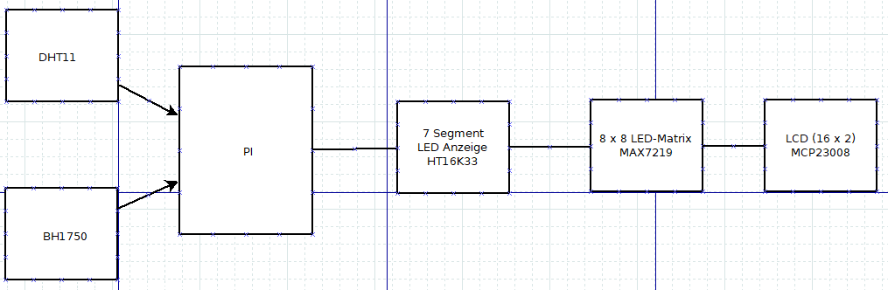

.. greenhouse documentation master file, created by
   sphinx-quickstart on Thu Jan  9 23:33:29 2025.
   You can adapt this file completely to your liking, but it should at least
   contain the root `toctree` directive.

Gewächshaus-Steuerungssystem
===========================

.. image:: _static/greenhouse_logo.png
   :alt: Gewächshaus Logo
   :align: center
   :width: 300px

Dies ist die technische Dokumentation für das **Gewächshaus-Steuerungssystem**. Dieses Projekt 
bietet ein komplettes Überwachungs- und Steuerungssystem für ein Gewächshaus 
mit Fokus auf den Anbau von Hanfblüten für die Pharma- und Teeindustrie.

Projektübersicht
---------------

Das Projekt wurde in mehreren Abschnitten entwickelt:

* **Abschnitt 1-2:** Analyse der Steuerung, Blockschaltbild, Sensorspezifikationen
* **Abschnitt 3:** Temperatur- und Luftfeuchtemessung mit dem DHT11-Sensor
* **Abschnitt 4:** Erweiterung der Anzeige mit LCD (2x16 Zeichen)
* **Abschnitt 5:** Integration eines Helligkeitssensors mit Bewertung und Symbolen
* **Abschnitt 6:** Helligkeitssteuerung mit Relais und Zeitserver-Synchronisation
* **Abschnitt 7:** Speicherung der Messwerte in einer Datenbank

Problemstellung
--------------

Das Gewächshaus-Steuerungssystem wurde entwickelt, um folgende Herausforderungen zu lösen:

* Kontinuierliche Überwachung der Umgebungsparameter für optimales Pflanzenwachstum
* Automatische Steuerung der Beleuchtungsbedingungen für Hanfblüten
* Präzise Datenerfassung und -speicherung für Analyse und Optimierung
* Benutzerfreundliche Visualisierung der Systemzustände für das Gärtnereipersonal
* Dauerhafte Dokumentation der Umgebungsbedingungen für Qualitätssicherung

Systemaufbau
-----------

   Systemdiagramm des Gewächshaus-Steuerungssystems

Hauptfunktionen
--------------

Das System umfasst folgende Hauptfunktionen:

* Erfassung von Temperatur- und Luftfeuchtigkeitsdaten über den DHT11-Sensor
* Messung des Umgebungslichts mit einem Helligkeitssensor
* Speicherung aller Messwerte mit Zeitstempel in einer SQLite-Datenbank
* Anzeige der aktuellen Temperatur und Luftfeuchtigkeit auf einem LCD-Display
* Visualisierung von Tag/Nacht-Zuständen über ein 8x8 LED-Matrix-Display
* Anzeige der numerischen Messwerte auf einem 7-Segment-Display
* Synchronisation der Systemzeit über einen lokalen NTP-Server
* Umfassende Protokollierung aller Aktivitäten und Fehler

Komponenten
----------

Das Projekt besteht aus folgenden Software-Komponenten:

* Ein benutzerdefiniertes Protokollierungsmodul (`school_logging`) für flexible und farbige Protokollierung
* Ein Messdaten-Modul (`greenhouse/messdaten.py`) für Sensor-Integration und Datenerfassung
* Datenbankfunktionen zur persistenten Speicherung der Messwerte
* Display-Steuerungsroutinen für verschiedene Anzeigeoptionen

Hardware-Komponenten:

* Raspberry Pi als zentrale Steuerungseinheit
* DHT11-Sensor für Temperatur und Luftfeuchtigkeit
* Helligkeitssensor zur Messung der Beleuchtungsstärke
* LCD-Display (2x16 Zeichen) für Textanzeige
* 7-Segment-LED-Anzeige für numerische Werte
* 8x8 LED-Matrix für Symbole (Tag/Nacht-Status)
* Relais zur Leistungssteuerung der Beleuchtung

Technische Daten
---------------

DHT11-Sensor:

* Messbereich Temperatur: 0-50°C (±2°C Genauigkeit)
* Messbereich Luftfeuchtigkeit: 20-90% RH (±5% RH Genauigkeit)
* Messintervall: 3 Sekunden

Helligkeitssensor:

* Empfindlichkeitsbereich: 0-65535 (umgerechnet in Lux)
* Schwellenwert für Tag/Nacht-Erkennung: 100 Lux

Display-Module:

* LCD: 16x2 Zeichen, I2C-Schnittstelle (Adresse 0x21)
* 7-Segment: 4-stellig, I2C-Schnittstelle (Adresse 0x70)
* LED-Matrix: 8x8 Pixel, SPI-Schnittstelle

Installation
------------

Um das Gewächshaus-Projekt zu installieren, folgen Sie diesen Schritten:

1.  Klonen Sie das Repository:

    .. code-block:: bash

        git clone https://github.com/vertok/Greenhouse.git

2.  Installieren Sie die erforderlichen Pakete:

    .. code-block:: bash

        pip install -r requirements.txt

3.  Stellen Sie die richtigen Berechtigungen ein:

    .. code-block:: bash
    
        sudo usermod -a -G gpio,i2c,spi $USER
        
4.  Führen Sie das Hauptprogramm aus:

    .. code-block:: bash
    
        python3 -m greenhouse.main --iterations 100 --interval 5

Beispiel für die Verwendung
---------------------------

Hier ist ein schnelles Beispiel, wie Sie den `ColoredLogger` aus dem `school_logging` Modul verwenden können:

.. code-block:: python

    from school_logging.log import ColoredLogger

    log = ColoredLogger(__name__)
    log.info("Dies ist eine Informationsnachricht.")

Und hier ist ein Beispiel für die Verwendung der `MeasurementSystem`-Klasse:

.. code-block:: python

    from school_logging.log import ColoredLogger
    from greenhouse.messdaten import MeasurementSystem
    
    log = ColoredLogger("gewächshaus")
    messsystem = MeasurementSystem(log)
    
    # Datenbank erstellen und initialisieren
    messsystem.create_database()
    
    # Beispielwerte zur Anzeige
    temperatur = 23.5
    luftfeuchtigkeit = 45.2
    helligkeit = 256
    
    # Alle Anzeigen aktualisieren
    messsystem.update_all_displays(temperatur, luftfeuchtigkeit, helligkeit)

Anforderungen an die Lichtsteuerung
-----------------------------------

Für den optimalen Anbau von Hanfblüten ist eine präzise Lichtsteuerung essentiell. Das System überwacht:

* Die Beleuchtungsstärke in Lux für optimales Pflanzenwachstum
* Tag/Nacht-Zyklen mittels integriertem Zeitserver (NTP)
* Automatische Anpassung der Beleuchtung basierend auf Umgebungslicht und Tageszeit

Die Helligkeitswerte werden auf der LED-Matrix durch verschiedene Symbole visualisiert, 
um den Mitarbeitern der Gärtnerei eine schnelle Statusüberprüfung zu ermöglichen.

Matrix-Symbole:

* |sun_symbol| **Sonnensymbol**: Zeigt ausreichende Helligkeit an (>100 Lux)
* |moon_symbol| **Mondsymbol**: Zeigt niedrige Helligkeit an (<100 Lux)

.. |sun_symbol| unicode:: U+2600 .. SUN
.. |moon_symbol| unicode:: U+263D .. FIRST QUARTER MOON

.. toctree::
   :maxdepth: 2
   :caption: Inhalt:

   school_logging
   messdaten

Indices und Tabellen
====================

* :ref:`genindex`
* :ref:`modindex`
* :ref:`search`
