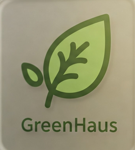

.. greenhouse documentation master file, created by
   sphinx-quickstart on Thu Jan  9 23:33:29 2025.
   You can adapt this file completely to your liking, but it should at least
   contain the root `toctree` directive.

Gewächshaus-Steuerungssystem
============================

Dies ist die technische Dokumentation für das **Gewächshaus-Steuerungssystem**. Dieses Projekt 
bietet ein komplettes Überwachungs- und Steuerungssystem für ein Gewächshaus 
mit Fokus auf den Anbau von Hanfblüten für die Pharma- und Teeindustrie.

Projektübersicht
----------------

Das Projekt "Gewächshaus-Steuerungssystem" wurde für die Floristik GmbH (Version 3.0.0) in mehreren definierten Abschnitten entwickelt:

* **Abschnitt 1-2 (KW 01-02/2025):** :ref:`analyse-steuerung` - Analyse der Anforderungen und Hardware-Komponenten, Erstellung des Blockschaltbildes.
* **Abschnitt 3 (KW 03/2025):** :ref:`temperatur-messung` - Implementierung der Temperaturmessung mit DHT11 und Anzeige auf 7-Segment-Display.
* **Abschnitt 4 (KW 04-05/2025):** :ref:`lcd-display` - Integration des LCD-Displays für verbesserte Anzeige der Messwerte.
* **Abschnitt 5 (KW 06-08/2025):** :ref:`helligkeitssensor` - Erweiterung um Helligkeitssensor und LED-Matrix für Statussymbole.
* **Abschnitt 6 (KW 09-11/2025):** :ref:`lichtsteuerung` - Integration der Relais-Steuerung und NTP-Zeitsynchronisation.
* **Abschnitt 7 (KW 12-13/2025):** :ref:`datenbankspeicherung` - Implementierung der SQLite-Datenbank zur persistenten Speicherung aller Messwerte.

Durch die schrittweise Entwicklung in definierten Teilabschnitten wurde ein vollständiges Steuerungssystem für die Überwachung und Regelung der kritischen Wachstumsparameter im Gewächshaus implementiert. Das System ist für den kontinuierlichen 24/7-Betrieb ausgelegt und ermöglicht präzise Kontrolle über Beleuchtung, Temperatur und Luftfeuchtigkeit, die für den Anbau von Hanfblüten entscheidend sind.

.. _analyse-steuerung:

Analyse der Steuerung
---------------------

In den ersten beiden Wochen des Projekts wurde eine umfassende Analyse der Steuerungshardware und -software durchgeführt. Dabei entstand ein detailliertes Blockschaltbild, das die gesamte geplante Steuerung aller Projektabschnitte darstellt.

Zudem wurde eine Übersicht über die Messbereiche und Toleranzen aller verwendeten Sensoren erstellt und entsprechende Datenblätter hinzugefügt.

.. _temperatur-messung:

Temperatur- und Luftfeuchtemessung
----------------------------------

Im dritten Projektabschnitt wurde die Temperaturmessung mit dem Sensor DHT11 und der 7-Segment-LED-Anzeige in Betrieb genommen und im Dauerbetrieb getestet. 

Die Temperaturwerte werden mit ausreichender Genauigkeit angezeigt. Ein entsprechendes Protokoll dokumentiert diesen Prozess.

Im vierten Projektabschnitt wurde der Luftfeuchtesensor des DHT11 integriert. Die Daten dieses Sensors werden mit erfasst und in sinnvoller Genauigkeit angezeigt.

.. _lcd-display:

Erweiterung der Anzeige
-----------------------

Die erfassten Werte für Temperatur und Luftfeuchte werden zusätzlich zur Siebensegmentanzeige gemeinsam in einem LCD (2 x 16) angezeigt. 

Das LCD-Display bietet eine bessere Lesbarkeit und ermöglicht die gleichzeitige Darstellung beider Messwerte mit Beschriftung.

.. _helligkeitssensor:

Integration des Helligkeitssensors
----------------------------------

Da die Gärtnerei Hanfblüten zur Teeherstellung und für die Pharmaindustrie anbaut, muss die Beleuchtung für blühenden Hanf sichergestellt werden. Dazu wurde ein Helligkeitssensor in die Steuerung integriert.

Die Helligkeit wird bewertet und die Bewertung mittels verschiedener Symbole auf der Matrixanzeige signalisiert:

* |sun_symbol| **Sonnensymbol**: Zeigt ausreichende Helligkeit an (>100 Lux)
* |moon_symbol| **Mondsymbol**: Zeigt niedrige Helligkeit an (<100 Lux)

.. |sun_symbol| unicode:: U+2600 .. SUN
.. |moon_symbol| unicode:: U+263D .. FIRST QUARTER MOON

.. _lichtsteuerung:

Helligkeitssteuerung
--------------------

Auf Grundlage der bewerteten Helligkeit wurde eine Lichtsteuerung mit Leistungskreis (Relais) implementiert. Dabei wird die aktuelle Tageszeit (Sonnenauf- und -untergang) berücksichtigt.

Die Systemzeit wird kontinuierlich über einen lokalen Zeitserver (10.254.5.115) aktualisiert, um eine präzise zeitgesteuerte Beleuchtung zu gewährleisten.

.. _datenbankspeicherung:

Datenspeicherung
----------------

Alle gemessenen Werte werden mit Zeitstempel in einer SQLite-Datenbank gespeichert. Dies umfasst:

* Zeitstempel (synchronisiert über NTP)
* Temperaturwerte
* Luftfeuchtigkeitswerte
* Helligkeitswerte

Diese Datenbank ermöglicht eine spätere Auswertung der Umgebungsbedingungen und dient als Grundlage für die Optimierung der Wachstumsbedingungen.

Problemstellung
---------------

Das Gewächshaus-Steuerungssystem wurde entwickelt, um folgende Herausforderungen zu lösen:

* Kontinuierliche Überwachung der Umgebungsparameter für optimales Pflanzenwachstum
* Automatische Steuerung der Beleuchtungsbedingungen für Hanfblüten
* Präzise Datenerfassung und -speicherung für Analyse und Optimierung
* Benutzerfreundliche Visualisierung der Systemzustände für das Gärtnereipersonal
* Dauerhafte Dokumentation der Umgebungsbedingungen für Qualitätssicherung

.. _systemaufbau:

Systemaufbau
------------

.. figure:: _static/system_diagram.png
   :alt: Systemdiagramm
   :align: center
   :width: 80%

   Systemdiagramm des Gewächshaus-Steuerungssystems

.. _hauptfunktionen:

Hauptfunktionen
---------------

Das System umfasst folgende Hauptfunktionen:

* Erfassung von Temperatur- und Luftfeuchtigkeitsdaten über den DHT11-Sensor
* Messung des Umgebungslichts mit einem Helligkeitssensor
* Speicherung aller Messwerte mit Zeitstempel in einer SQLite-Datenbank
* Anzeige der aktuellen Temperatur und Luftfeuchtigkeit auf einem LCD-Display
* Visualisierung von Tag/Nacht-Zuständen über ein 8x8 LED-Matrix-Display
* Anzeige der numerischen Messwerte auf einem 7-Segment-Display
* Synchronisation der Systemzeit über einen lokalen NTP-Server
* Umfassende Protokollierung aller Aktivitäten und Fehler

.. _komponenten:

Komponenten
-----------

Das Projekt besteht aus folgenden Software-Komponenten:

* Ein benutzerdefiniertes Protokollierungsmodul (`school_logging`) für flexible und farbige Protokollierung
* Ein Messdaten-Modul (`greenhouse/messdaten.py`) für Sensor-Integration und Datenerfassung
* Datenbankfunktionen zur persistenten Speicherung der Messwerte
* Display-Steuerungsroutinen für verschiedene Anzeigeoptionen

Hardware-Komponenten:

* Raspberry Pi als zentrale Steuerungseinheit
* DHT11-Sensor für Temperatur und Luftfeuchtigkeit
* Helligkeitssensor zur Messung der Beleuchtungsstärke
* LCD-Display (2x16 Zeichen) für Textanzeige
* 7-Segment-LED-Anzeige für numerische Werte
* 8x8 LED-Matrix für Symbole (Tag/Nacht-Status)
* Relais zur Leistungssteuerung der Beleuchtung

.. _technische-daten:

Technische Daten
----------------

DHT11-Sensor:

* Messbereich Temperatur: 0-50°C (±2°C Genauigkeit)
* Messbereich Luftfeuchtigkeit: 20-90% RH (±5% RH Genauigkeit)
* Messintervall: 3 Sekunden

Helligkeitssensor:

* Empfindlichkeitsbereich: 0-65535 (umgerechnet in Lux)
* Schwellenwert für Tag/Nacht-Erkennung: 100 Lux

Display-Module:

* LCD: 16x2 Zeichen, I2C-Schnittstelle (Adresse 0x21)
* 7-Segment: 4-stellig, I2C-Schnittstelle (Adresse 0x70)
* LED-Matrix: 8x8 Pixel, SPI-Schnittstelle

.. _struktogramm-der-steuerungssoftware:

Struktogramm der Steuerungssoftware
-----------------------------------

Das folgende Struktogramm (auch als Nassi-Shneiderman-Diagramm bekannt) beschreibt den logischen Ablauf der Gewächshaus-Steuerungssoftware. Es zeigt den Programmfluss von der Initialisierung über die Datenerfassung bis hin zur Datenspeicherung und Anzeigenaktualisierung.

   Struktogramm des Programms zur Gewächshaus-Steuerung

Das Struktogramm zeigt folgende Hauptprozesse:

1. **Initialisierung** der Hardware-Komponenten und Datenbankverbindungen
2. **Messdatenerfassung** von Temperatur, Luftfeuchtigkeit und Helligkeit
3. **Datenverarbeitung** mit Bewertung der Messgrößen
4. **Anzeigenaktualisierung** auf LCD, LED-Matrix und 7-Segment-Display
5. **Datenspeicherung** in der SQLite-Datenbank
6. **Tag-/Nachtsteuerung** der Beleuchtung basierend auf Helligkeitsdaten

Der Hauptprogrammablauf ist als kontinuierliche Schleife implementiert, die in regelmäßigen Intervallen Messdaten erfasst und verarbeitet.

Installation
------------

Um das Gewächshaus-Projekt zu installieren, folgen Sie diesen Schritten:

1.  Klonen Sie das Repository:

    .. code-block:: bash

        git clone https://github.com/vertok/Greenhouse.git

2.  Installieren Sie die erforderliche Pakete:

    .. code-block:: bash

        cd Greenhouse
        pip install -e .

3.  Führen Sie das Hauptprogramm aus:

    .. code-block:: bash
    
        python3 greenhouse/main.py --iterations 10 --interval 3

.. _beispiel-für-die-verwendung:

Beispiel für die Verwendung
---------------------------

Hier ist ein schnelles Beispiel, wie Sie den `ColoredLogger` aus dem `school_logging` Modul verwenden können:

.. code-block:: python

    from school_logging.log import ColoredLogger

    log = ColoredLogger(__name__)
    log.info("Dies ist eine Informationsnachricht.")

Und hier ist ein Beispiel für die Verwendung der `MeasurementSystem`-Klasse:

.. code-block:: python

    from school_logging.log import ColoredLogger
    from greenhouse.messdaten import MeasurementSystem
    
    log = ColoredLogger("gewächshaus")
    messsystem = MeasurementSystem(log)
    
    # Datenbank erstellen und initialisieren
    messsystem.create_database()
    
    # Beispielwerte zur Anzeige
    temperatur = 23.5
    luftfeuchtigkeit = 45.2
    helligkeit = 256
    
    # Alle Anzeigen aktualisieren
    messsystem.update_all_displays(temperatur, luftfeuchtigkeit, helligkeit)

.. _anforderungen-an-die-lichtsteuerung:

Anforderungen an die Lichtsteuerung
-----------------------------------

Für den optimalen Anbau von Hanfblüten ist eine präzise Lichtsteuerung essentiell. Das System überwacht:

* Die Beleuchtungsstärke in Lux für optimales Pflanzenwachstum
* Tag/Nacht-Zyklen mittels integriertem Zeitserver (NTP)
* Automatische Anpassung der Beleuchtung basierend auf Umgebungslicht und Tageszeit

Die Helligkeitswerte werden auf der LED-Matrix durch verschiedene Symbole visualisiert, 
um den Mitarbeitern der Gärtnerei eine schnelle Statusüberprüfung zu ermöglichen.

Matrix-Symbole:

* |sun_symbol| **Sonnensymbol**: Zeigt ausreichende Helligkeit an (>100 Lux)
* |moon_symbol| **Mondsymbol**: Zeigt niedrige Helligkeit an (<100 Lux)

.. |sun_symbol| unicode:: U+2600 .. SUN
.. |moon_symbol| unicode:: U+263D .. FIRST QUARTER MOON

.. toctree::
   :maxdepth: 2
   :caption: Inhalt:

   messdaten

Glossar und Fachbegriffe
========================

.. glossary::
   :sorted:

   Abschnitt 1-2: Analyse der Steuerung
      Die ersten Projektabschnitte, in denen eine umfassende Analyse der Steuerungshardware und -software durchgeführt wurde. :ref:`Mehr Details <analyse-steuerung>`.

   Abschnitt 3: Temperaturmessung
      Projektabschnitt zur Inbetriebnahme der Temperaturmessung mit dem DHT11-Sensor und Anzeige auf 7-Segment-Display. :ref:`Mehr Details <temperatur-messung>`.

   Abschnitt 4: LCD-Display
      Erweiterung der Anzeigefunktionen durch Integration eines LCD-Displays für verbesserte Darstellung der Messwerte. :ref:`Mehr Details <lcd-display>`.

   Abschnitt 5: Helligkeitssensor
      Integration eines Helligkeitssensors und LED-Matrix zur Visualisierung der Lichtverhältnisse mittels Symbolen. :ref:`Mehr Details <helligkeitssensor>`.

   Abschnitt 6: Lichtsteuerung
      Implementation einer Relais-Steuerung für die Gewächshausbeleuchtung basierend auf Helligkeitsmessungen und Tageszeit. :ref:`Mehr Details <lichtsteuerung>`.

   Abschnitt 7: Datenbankintegration
      Speicherung aller Messwerte mit Zeitstempel in einer SQLite-Datenbank für spätere Analysen. :ref:`Mehr Details <datenbankspeicherung>`.

   ColoredLogger
      Benutzerdefinierte Logger-Klasse für farbige Konsolenausgabe und Dateiprotokollierung. :ref:`Beispiel <beispiel-für-die-verwendung>`.

   DHT11
      Ein kostengünstiger digitaler Temperatur- und Luftfeuchtigkeitssensor, der im Projekt für die grundlegende Umgebungsüberwachung verwendet wird. :ref:`Technische Daten <technische-daten>`.

   GPIO
      General Purpose Input/Output - Pins am Raspberry Pi, die zur Steuerung und Auslesen von externen Komponenten verwendet werden. :ref:`Hardware-Komponenten <komponenten>`.

   I2C
      Inter-Integrated Circuit - Ein serieller Kommunikationsbus zur Verbindung des Raspberry Pi mit LCD- und 7-Segment-Displays. :ref:`Technische Daten <technische-daten>`.

   LCD
      Liquid Crystal Display - Ein 16x2-Zeichen-Display zur Anzeige von Temperatur- und Feuchtigkeitswerten. :ref:`Mehr Details <lcd-display>`.

   LED-Matrix
      Eine 8x8-Pixel-Matrix zur Anzeige von Status-Symbolen (Tag/Nacht) basierend auf den Helligkeitsmessungen. :ref:`Mehr Details <helligkeitssensor>`.

   Lux
      Einheit der Beleuchtungsstärke, verwendet zur Messung und Bewertung der Umgebungshelligkeit im Gewächshaus. :ref:`Anforderungen an die Lichtsteuerung <anforderungen-an-die-lichtsteuerung>`.

   MCP3008
      Ein Analog-Digital-Wandler, der verwendet wird, um analoge Signale vom Helligkeitssensor in digitale Werte für den Raspberry Pi umzuwandeln. :ref:`Hardware-Komponenten <komponenten>`.

   MeasurementSystem
      Hauptklasse zur Steuerung aller Funktionen des Gewächshaus-Systems. :ref:`Beispiel <beispiel-für-die-verwendung>`.

   NTP
      Network Time Protocol - Ein Protokoll zur Synchronisation der Systemzeit über einen Zeitserver (10.254.5.115), wichtig für die zeitgesteuerte Beleuchtung. :ref:`Mehr Details <lichtsteuerung>`.

   Raspberry Pi
      Einplatinencomputer, der als zentrale Steuerungseinheit des Gewächshaus-Systems dient. :ref:`Hardware-Komponenten <komponenten>`.

   Relais
      Ein elektromagnetischer Schalter zur Steuerung der Gewächshausbeleuchtung basierend auf Helligkeitswerten und Tageszeit. :ref:`Mehr Details <lichtsteuerung>`.

   7-Segment-Display
      Eine numerische Anzeige für Temperatur- und Luftfeuchtigkeitswerte mit vier Stellen. :ref:`Technische Daten <technische-daten>`.

   SPI
      Serial Peripheral Interface - Ein serieller Kommunikationsbus zur Verbindung des Raspberry Pi mit der LED-Matrix. :ref:`Hardware-Komponenten <komponenten>`.

   SQLite
      Eine leichte, dateibasierte Datenbank zur Speicherung aller Messdaten des Gewächshauses. :ref:`Mehr Details <datenbankspeicherung>`.

   Struktogramm
      Eine grafische Darstellung eines Algorithmus (auch Nassi-Shneiderman-Diagramm genannt), die den Programmablauf veranschaulicht. :ref:`Struktogramm der Steuerungssoftware <struktogramm-der-steuerungssoftware>`.

   Systemaufbau
      Übersicht der Hardwarekomponenten und deren Zusammenspiel im Gewächshaus-Steuerungssystem. :ref:`Mehr Details <systemaufbau>`.

Verwendete Abbildungen
======================

Diese Dokumentation enthält folgende Abbildungen und Diagramme:

.. list-table::
   :widths: 30 70
   :header-rows: 1

   * - Abbildung
     - Beschreibung
   * - .. image:: _static/greenhouse_logo.png
          :width: 100px
          :alt: Gewächshaus Logo
     - Logo des Gewächshaus-Steuerungsprojekts
   * - .. image:: _static/system_diagram.png
          :width: 200px
          :alt: Schaltungsplan
     - Blockschaltbild des gesamten Steuerungssystems mit allen Komponenten
   * - |sun_symbol|
     - Symbol für ausreichende Helligkeit (Tag-Modus) auf der LED-Matrix
   * - |moon_symbol|
     - Symbol für geringe Helligkeit (Nacht-Modus) auf der LED-Matrix

Beispiel Messdaten
==================

Die folgende Tabelle zeigt die gesammelten Messdaten aus dem Gewächshaus wenn man künstlich die Beleuchtung ändernt:

.. csv-table:: Gewächshaus Messdaten
   :file: ../../greenhouse/messdaten.csv
   :header-rows: 1
   :widths: 5, 20, 15, 15, 15
